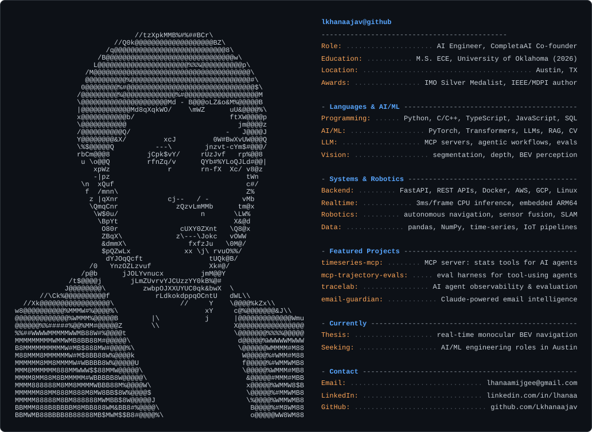

  <picture>
    <source media="(prefers-color-scheme: dark)" srcset="dark_mode.svg">
    <source media="(prefers-color-scheme: light)" srcset="light_mode.svg">
    
  </picture>

# Lkhanaajav Mijiddorj

**AI Engineer · MS ECE @ University of Oklahoma (May 2026) · Austin, TX**

IMO Silver Medalist · CompletaAI Co-founder · Published Researcher (IEEE, MDPI Sensors)

I build production AI systems — real-time inference pipelines, LLM-powered applications, and robotics perception stacks. Currently finishing my MS thesis on monocular BEV perception for autonomous navigation while co-founding an AI startup and running ML research with a federally funded sensor program.

---

## Featured Projects

### [timeseries-mcp](https://github.com/Lkhanaajav/timeseries-mcp)
Deterministic time-series statistics for AI agents — an MCP server exposing 17 typed tools (STL-residual anomaly detection, CUSUM changepoints, seasonal decomposition, ADF+KPSS stationarity, Mann-Kendall trend tests, backtested baseline forecasts) with schema-validated structured output and **no arbitrary code execution**. Series load once into a server-side registry, so million-point datasets never enter model context. Path-sandboxed CSV ingestion, 57 golden statistical tests over the real MCP transport, stdio + Streamable HTTP.

**Stack:** Python · FastMCP · MCP structured output · numpy/scipy/statsmodels · pytest · CI (GitHub Actions)

---

### [mcp-trajectory-evals](https://github.com/Lkhanaajav/mcp-trajectory-evals)
Trajectory-level evaluation harness for tool-using agents. Drives agents against a **real MCP server** and scores every step — tool selection F1, argument correctness, grounding (every number in the answer must trace to a tool result), and efficiency — because final-output-only evals miss broken trajectories under plausible answers. Ships a deterministic scripted runner (CI-safe, no API key), a live Claude runner, a replay mode, and a `trajeval gate` command that fails builds on regression vs. a committed baseline. Sabotage tests prove the scorers catch hallucinated numbers, skipped tools, and wrong parameters.

**Stack:** Python · MCP · Anthropic API · pydantic · YAML task suites · CI regression gates

---

### [tracelab-ai-agent-observability](https://github.com/Lkhanaajav/tracelab-ai-agent-observability)
AI agent observability and evaluation platform. A Python tracing SDK instruments agent runs and ships prompts, tool calls, observations, latency, token usage, and cost to a FastAPI backend. A React dashboard replays trace timelines, shows structured JSON event payloads, and renders eval scorecards. Includes deterministic eval quality gates usable in CI for regression-testing agent behavior before release.

**Stack:** Python · FastAPI · SQLite · React · TypeScript · Vite · CI (GitHub Actions)

---

### [email-guardian](https://github.com/Lkhanaajav/email-guardian)
AI-powered email intelligence platform. Connects to Gmail via OAuth 2.0, auto-fetches and classifies every email, generates Claude-powered summaries, extracts action items, and lets you query your inbox in natural language.

**Stack:** Python · FastAPI · AsyncAnthropic · SQLAlchemy · React · TailwindCSS · APScheduler · Docker

---

### [Real-Time Monocular BEV Perception](https://github.com/Lkhanaajav/live_test_scooter_project)
MS thesis. Full autonomous navigation pipeline for a robotic scooter — monocular depth → semantic segmentation → BEV projection → navigable path extraction → control — running at **3.0 ms per frame** on CPU-only embedded hardware. No LiDAR. No GPU.

**Results:** IoU 0.964 · 14.5 px mean path accuracy (p < 10⁻⁶¹) · 330 Hz capable

**Stack:** Python · PyTorch · OpenCV · C++ · Linux · ARM64

---

### [uichuur](https://github.com/Lkhanaajav/uichuur)
127 AI-generated illustrations in traditional Mongolian Tsagaan Zurag folk art style for a card game — built using Pollinations.ai API with custom retry and regeneration logic.

**Stack:** Python · Stable Diffusion · Image generation pipelines

---

## Research & Publications

| | |
|---|---|
| **AIMNET: IoT Digital Twin for Continuous Gas Emission Monitoring** | *IEEE*, Jan 2026 |
| **ML-Enhanced NDIR Methane Sensing Solution for Outdoor Monitoring** | *Sensors (MDPI)*, Dec 2025 |
| **Portable Smoking Detection with Real-Time Data Quality Assurance** | *IoT (Elsevier)*, Submitted 2026 |

Selected as 1 of 5 engineering students for a highly funded federally sponsored AI + sensing research program at OU.

---

## Skills

**Languages:** Python · C · C++ · TypeScript · JavaScript · SQL · Bash  
**Agentic AI:** MCP (Model Context Protocol) server development · agent evaluation (trajectory-level, LLM-as-judge) · tool use / structured output · Anthropic API · eval-gated CI  
**ML / AI:** PyTorch · Transformers · LLMs · RAG pipelines · prompt engineering · computer vision · semantic segmentation · BEV perception  
**Systems:** FastAPI · Docker · AWS · GCP · Linux · REST APIs · real-time inference · embedded deployment  
**Robotics:** autonomous navigation · path planning · sensor fusion · monocular depth · SLAM

---

## Currently

- Co-founding **CompletaAI** — AI matching and retrieval engine built on learned embeddings + multi-signal ranking
- Building open-source agentic infrastructure: an [MCP server](https://github.com/Lkhanaajav/timeseries-mcp) and a [trajectory-level agent eval harness](https://github.com/Lkhanaajav/mcp-trajectory-evals)
- Finishing MS ECE thesis on real-time monocular BEV perception
- Actively applying to ML / Robotics / AI engineering roles in **Austin, TX**

**Email:** lhanaamijgee@gmail.com · [LinkedIn](https://linkedin.com/in/lhanaa)
